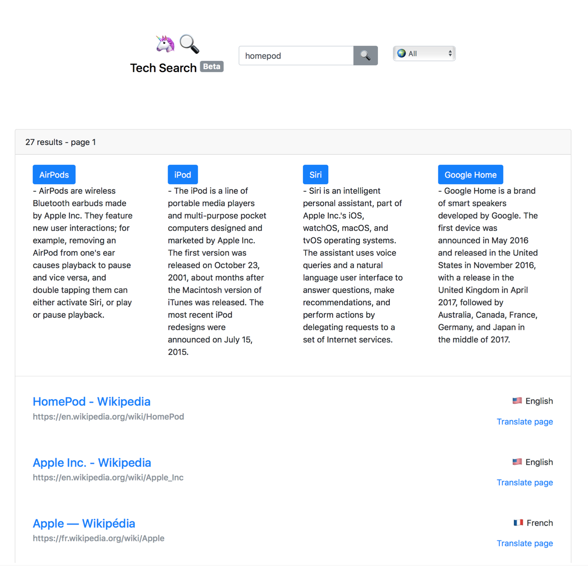

# Tech Search

    

## Description
Tech Search is a search engine that allows searching Wikipedia pages of the biggest tech companies in 4 different languages. 
Pages of companies like Apple, Google, Facebook, Twitter and Uber were first crawled with Nutch and then indexed with Solr to allow fast searching. After a search is performed and the results are presented, in case the user query is considered ambiguous by the DuckDuckGo API, some disambiguation options are presented to the user.
This allows to find relevant Wikipedia pages as fast as possible.

## Installation
You will be need to install Solr and provide your own implementation of the search platform. Feel free to use this project a starting point for your own search engine.

## Motivation
This project was the final project assigned to me in my Informational Retrieval course.

## Author

I'm [Patrick Balestra](http://www.patrickbalestra.com)

Email: [me@patrickbalestra.com](mailto:me@patrickbalestra.com)

Twitter: [@BalestraPatrick](http://twitter.com/BalestraPatrick)

## License

`TechSearch` is available under the MIT license. See the [LICENSE](LICENSE) file for more info.